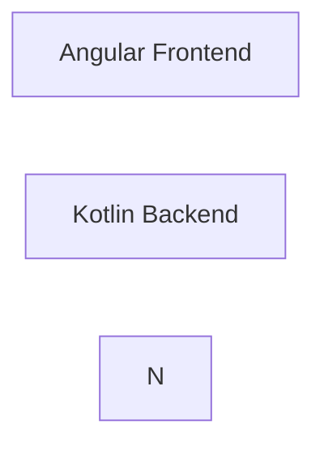

# Product Requirements Document (PRD)

## Projekttitel
**KI-gestützte Orchestrierung von Wissensgraphen am Beispiel von Städtepartnerschaften**

---

## 1. Ziel des Dokuments

Dieses Dokument beschreibt die Anforderungen an ein forschungsorientiertes System,
das untersucht, wie **n8n**, **generative KI** und **Graphdatenbanken**
zur strukturierten Wissensgenerierung und -exploration eingesetzt werden können.

Das PRD dient als:
- gemeinsame Referenz für Architektur, Methodik und Implementierung
- Grundlage für Evaluation und Diskussion
- Abgrenzung gegenüber produktiven Systemen

---

## 2. Vision

Das System soll zeigen, wie **komplexe, KI-gestützte Recherche- und Analyseprozesse**
transparent, reproduzierbar und kritisch reflektiert orchestriert werden können.

Im Fokus steht **nicht die „richtige Antwort“**, sondern:
- der Weg der Wissensentstehung
- die Strukturierung von Unsicherheit
- die explizite Trennung von Fakt, Quelle und Interpretation

---

## 3. Problemstellung

Städtepartnerschaften sind:
- historisch gewachsen
- kulturell unterschiedlich motiviert
- global vernetzt
- oft nur fragmentarisch dokumentiert

Klassische Dokumentensammlungen oder lineare Recherchen:
- verschleiern Zusammenhänge
- vermischen Fakt und Interpretation
- sind schwer reproduzierbar

---

## 4. Zielsetzung

### 4.1 Fachliche Ziele

- Aufbau eines Wissensgraphen zu Städtepartnerschaften
- Analyse von Motiven, Kontexten und Mustern
- Vergleich kultureller Verständnisse von Städtepartnerschaften
- Explorative Fragestellungen (z. B. „Welche Motive dominieren in welchen Regionen?“)

### 4.2 Methodische Ziele

- Untersuchung von n8n als Orchestrierungswerkzeug
- Bewertung generativer KI als Recherche- und Analyseinstrument
- Trennung von Orchestrierung, KI und Persistenz
- Nachvollziehbarkeit und Reproduzierbarkeit

---

## 5. Zielgruppen (Proto-Personas)

### Forscherin Anna
- akademischer Hintergrund
- Interesse an vergleichender Analyse
- Fokus auf Methodik, Nachvollziehbarkeit und Datenstruktur

### Journalist Lukas
- arbeitet narrativ
- sucht erklärbare Muster und Geschichten
- stellt offene Fragen an das System

---

## 6. Use Cases (High-Level)

- Recherche zu einer einzelnen Stadt
- Erweiterung des Wissensgraphen über Partnerschaften
- Analyse von Motivlagen
- Vergleich mehrerer Städte oder Regionen
- Beantwortung offener Fragestellungen über das Frontend

---

## 7. Funktionale Anforderungen

### 7.1 Orchestrierung (n8n)

- Steuerung der Recherche- und Analyseprozesse
- Abbildung reproduzierbarer Workflows
- Trennung einzelner Prozessphasen:
  - `research_city`
  - `expand_graph`
  - `analyze_motivation`

### 7.2 Wissensgraph

- Knoten: Städte, Länder, Konzepte
- Kanten: Städtepartnerschaften, Beziehungen
- Speicherung strukturierter Fakten
- Erweiterbarkeit des Schemas

### 7.3 KI-Integration

- Externe KI (Gemini) für Web-Recherche
- Lokale KI (Ollama) für Analyse und Interpretation
- Austauschbarkeit der Modelle

### 7.4 Persistenz

- Rohdaten (Quellen, Texte)
- Strukturierte Fakten (Graph)
- Interpretationen (Markdown)

---

## 8. Nicht-funktionale Anforderungen

- Lokaler Betrieb aller Kernkomponenten
- Transparenz der Prozesse
- Reproduzierbarkeit
- Modularer Aufbau
- Verständliche Dokumentation

Nicht priorisiert:
- Performance
- Skalierung
- Hochverfügbarkeit

---

## 9. Architektur (Überblick)

