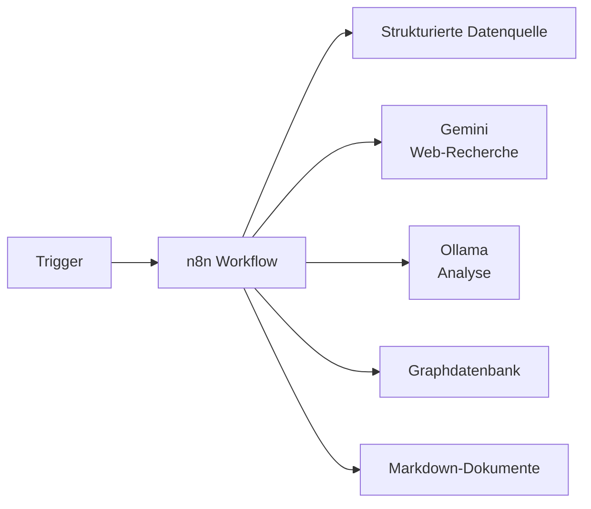

# n8n – Orchestrierung der KI-gestützten Wissensgenerierung

## Überblick

Dieses Verzeichnis enthält die **n8n-Workflows**, die im Rahmen der Studie zur  
**KI-gestützten Orchestrierung von Wissensgraphen** eingesetzt werden.

n8n fungiert hierbei als **zentrale Steuerungs- und Orchestrierungsschicht**, die
Recherche-, Analyse- und Persistenzprozesse koordiniert.  
n8n selbst übernimmt **keine KI-Funktionalität**, sondern steuert externe und lokale KI-Systeme.

---

## Rolle von n8n in der Studie

In dieser Studie wird n8n als **Low-Code-Orchestrierungswerkzeug** untersucht, insbesondere im Hinblick auf:

- Transparenz komplexer KI-Workflows
- Reproduzierbarkeit von Analyseprozessen
- Trennung von Steuerungslogik und KI-Funktionalität
- Nachvollziehbarkeit agentenähnlicher Abläufe

n8n ist damit ein **methodisches Instrument**, kein reines Automatisierungstool.

---

## Aufgaben der n8n-Workflows

Die hier enthaltenen Workflows übernehmen typischerweise folgende Aufgaben:

1. **Trigger-basierte Prozesse**
   - neue Stadt
   - fehlende Analyse
   - Nutzeranfrage

2. **Recherche**
   - Abfragen strukturierter Wissensquellen (z. B. Wikidata)
   - Web-Recherche über externe KI (Gemini)

3. **Analyse & Interpretation**
   - Übergabe recherchierter Inhalte an lokale LLMs (z. B. Ollama)
   - Extraktion von Motiven, Kontexten und Zusammenfassungen

4. **Persistenz**
   - Speicherung strukturierter Daten im Wissensgraphen
   - Ablage interpretativer Analysen als Markdown-Dokumente

---

## Workflow-Übersicht

```text
workflows/
├─ research_city.json          # Recherche zu einer Stadt
├─ expand_partnerships.json    # Erweiterung des Graphen um Partnerstädte
├─ analyze_motivation.json     # Analyse von Motiven & Kontexten
└─ compare_patterns.json       # Vergleichende Analysen (optional)
```
## Konzeptioneller Ablauf


